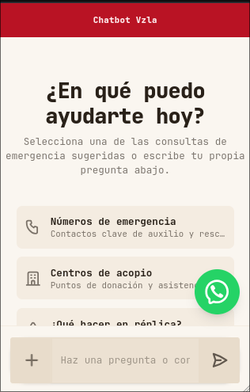

# Chatbot Vzla - Frontend de Asistencia de Emergencia

Frontend oficial del Chatbot de Asistencia Terremoto Venezuela desarrollado en Svelte 5 y SvelteKit para centralizar información y consultas críticas de ayuda.

---

## Integración como Widget (Embedding)

Para embeber este chatbot en cualquier sitio web externo, utiliza la ruta `/widget` en un iframe. Esta vista está optimizada para responsive y oculta elementos de navegación externos.

### Vista Previa del Widget:
<p align="center">
	
</p>

### Código HTML:

```html
<iframe
	src="https://chatbotvenezuela.vercel.app/widget?theme=dark"
	width="100%"
	height="700"
	style="border: none; border-radius: 24px; box-shadow: 0 10px 15px -3px rgba(0,0,0,0.1);"
	title="Chatbot de Asistencia - Terremoto Venezuela"
	allow="clipboard-write"
></iframe>
```

> El atributo `allow="clipboard-write"` es obligatorio para permitir la funcionalidad de copiado de mensajes al portapapeles desde el iframe.
> Puedes cambiar el parámetro de la URL `?theme=dark` por `?theme=light` para forzar el tema claro en el widget.


---

## Desarrollo Local

### Instalación

```bash
pnpm install
```

### Configuración

Copia `.env.example` a `.env` y añade tus credenciales:

```bash
cp .env.example .env
```

- `OPENROUTER_API_KEY`: API key para los modelos de lenguaje de OpenRouter.

### Ejecución

```bash
pnpm run dev
```

Acceso en local: [http://localhost:5173](http://localhost:5173).

### Producción

```bash
pnpm run build
pnpm run preview
```

---

## Tecnologías y Características

- Core: Svelte 5 + SvelteKit.
- Estilizado: Tailwind CSS v4 + DaisyUI v5.
- Funcionalidades: Carga de archivos por drag & drop, streaming de respuestas, copiado de mensajes y botón de reintento ante errores.
